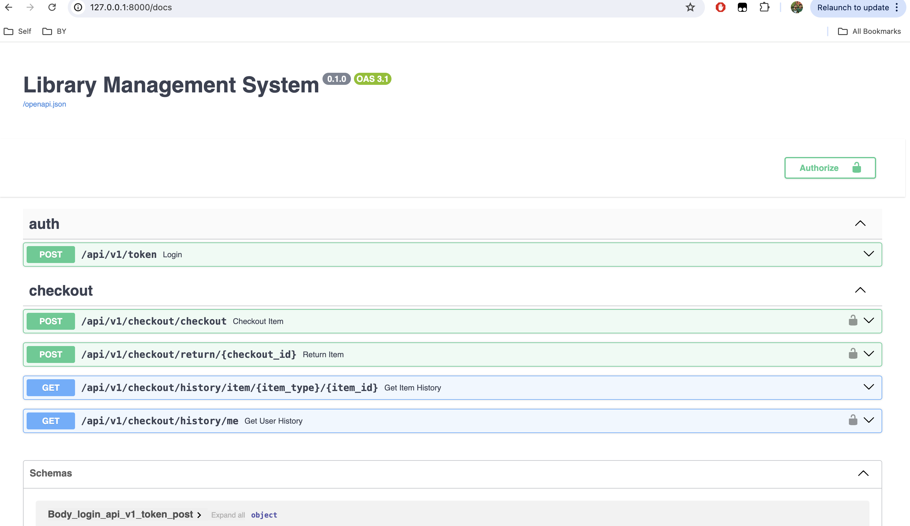
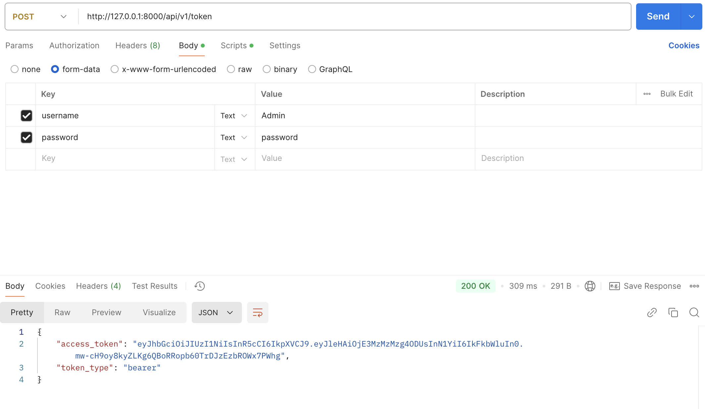

# Library-Management

Assumption: 
- DATABASE_URL=`postgresql://<username>:<password>@<HOSTNAME>/<DB_NAME>`
- SECRET_KEY=`your-secret-key-here`
- ALGORITHM=`HS256`
- ACCESS_TOKEN_EXPIRE_MINUTES=`30`
- User will above key value in `.env` file

Step 1: Run Alembic, ` alembic upgrade head`

NOTE: For time being , i have added dummy data, as api has limited scope.  

Step 2: Start the app using `uvicorn app.main:app --reload  `

Step 3: Navigate to `http://localhost:8080/docs` for swagger to check APIs

Step 4: Use username `Admin`, password : `password` for `Admin`
         Use username `Member`, password : `password` for `Member`

### Screenshots

Postman: `token` API

Postman: `item history` API

